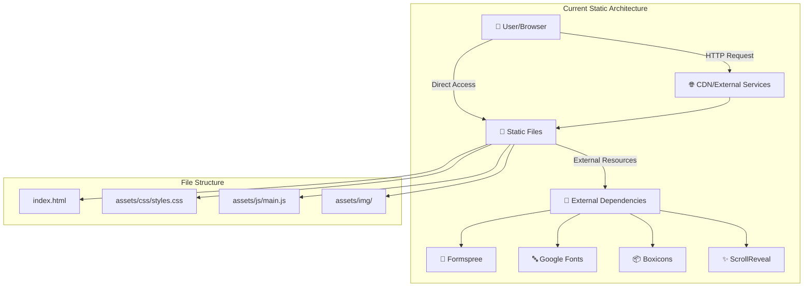
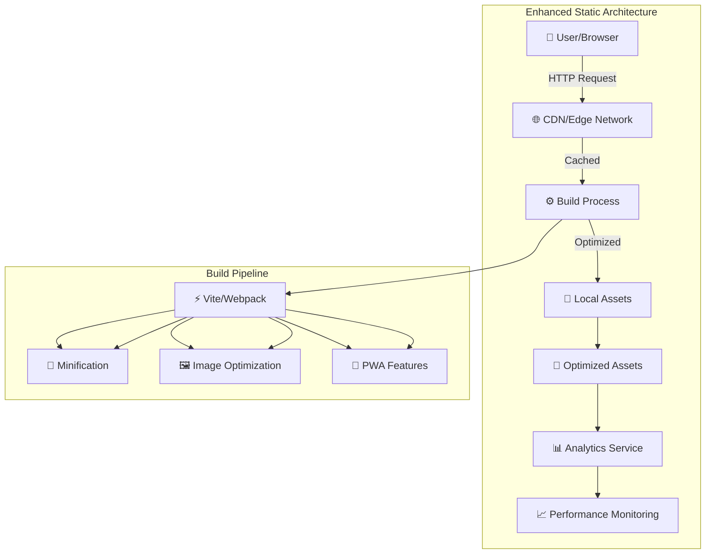
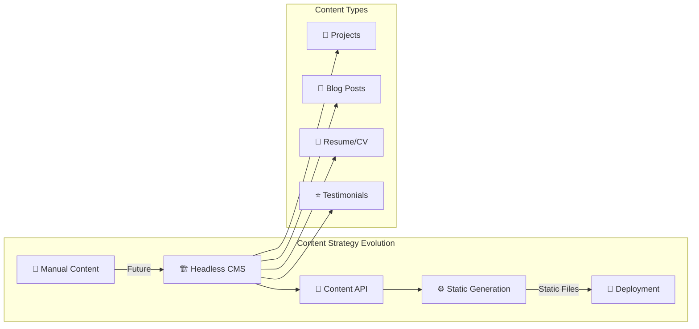
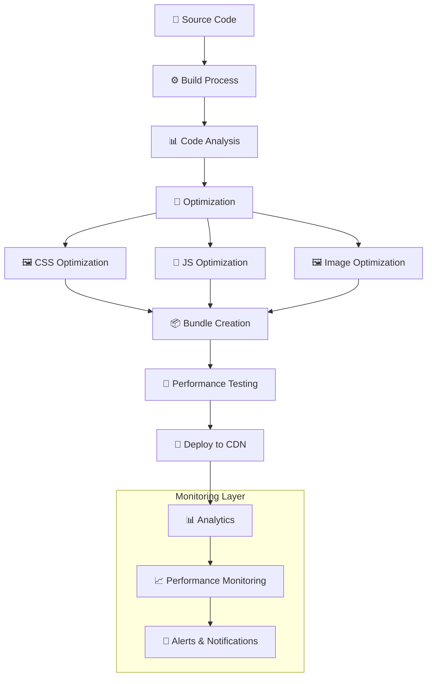
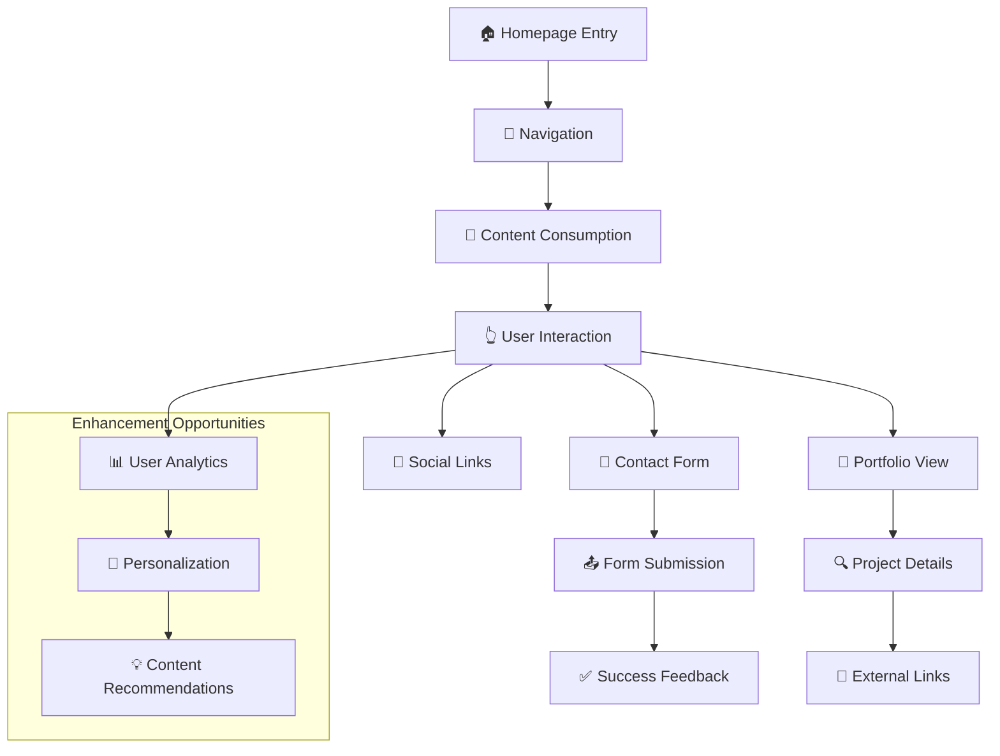
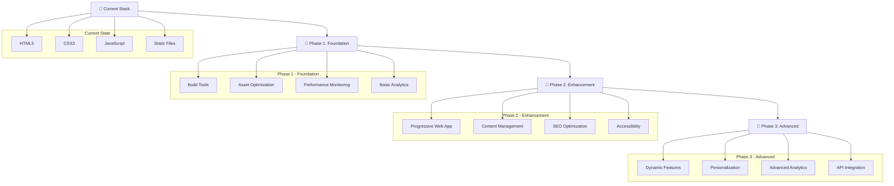
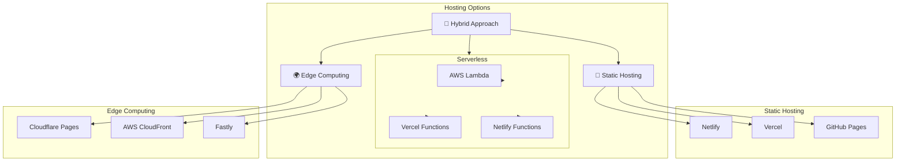

# Portfolio Website Architecture Diagrams

## Current Architecture Diagram



## Enhanced Architecture Diagram



## Content Management Architecture



## Performance Optimization Flow



## User Experience Flow



## Technology Evolution Path



## Deployment Architecture Options



## Security & Privacy Architecture

```mermaid
graph TB
    subgraph "Security Layers"
        HTTPS[🔒 HTTPS/SSL]
        CSP[🛡️ Content Security Policy]
        SRI[🔍 Subresource Integrity]
        Validation[✅ Input Validation]
    end
    
    subgraph "Privacy Considerations"
        Analytics[📊 Privacy-First Analytics]
        Cookies[🍪 Minimal Cookies]
        GDPR[📋 GDPR Compliance]
        Tracking[🚫 No Third-Party Tracking]
    end
    
    subgraph "Data Protection"
        Forms[📧 Form Data Protection]
        Storage[💾 Local Storage]
        Cache[🗂️ Cache Security]
    end
    
    HTTPS --> CSP
    CSP --> SRI
    SRI --> Validation
    
    Analytics --> Cookies
    Cookies --> GDPR
    GDPR --> Tracking
    
    Forms --> Storage
    Storage --> Cache
```



## Accessibility & Performance Metrics

```mermaid
graph LR
    subgraph "Performance Targets"
        LCP[🚀 LCP < 2.5s]
        FID[⚡ FID < 100ms]
        CLS[📏 CLS < 0.1]
        Load[📊 Load Time < 2s]
    end
    
    subgraph "Accessibility Standards"
        WCAG[♿ WCAG 2.1 AA]
        Screen[🖥️ Screen Reader]
        Keyboard[⌨️ Keyboard Navigation]
        Contrast[🎨 Color Contrast]
    end
    
    subgraph "Quality Metrics"
        Lighthouse[💡 Lighthouse Score > 90]
        Mobile[📱 Mobile Score > 90]
        SEO[🔍 SEO Score > 90]
        Best[✨ Best Practices]
    end
    
    LCP --> Lighthouse
    FID --> Mobile
    CLS --> SEO
    Load --> Best
    
    WCAG --> Lighthouse
    Screen --> Mobile
    Keyboard --> SEO
    Contrast --> Best